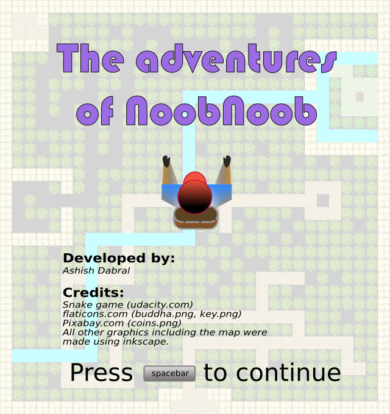
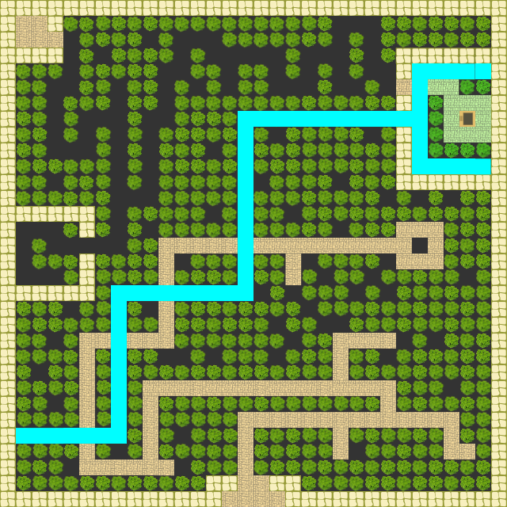

# CPPND: Udacity Capstone Game: The adventures of NoobNoob

Project description:
The adventures of NoobNoob is a puzzle game build for [Udacity C++ Nanodegree Program](https://www.udacity.com/course/c-plus-plus-nanodegree--nd213) as the final capstone project. The code for this repo was inspired by [this](https://codereview.stackexchange.com/questions/212296/snake-game-in-c-with-sdl) excellent StackOverflow post and set of responses. Even though this game was inspired by the SNAKE game template, it has been highly modified to provide the current game play.

## Dependencies for Running Locally
* cmake >= 3.7
  * All OSes: [click here for installation instructions](https://cmake.org/install/)
* make >= 4.1 (Linux, Mac), 3.81 (Windows)
  * Linux: make is installed by default on most Linux distros
  * Mac: [install Xcode command line tools to get make](https://developer.apple.com/xcode/features/)
  * Windows: [Click here for installation instructions](http://gnuwin32.sourceforge.net/packages/make.htm)
* SDL2 >= 2.0
  * All installation instructions can be found [here](https://wiki.libsdl.org/Installation)
  * Note that for Linux, an `apt` or `apt-get` installation is preferred to building from source.
* gcc/g++ >= 5.4
  * Linux: gcc / g++ is installed by default on most Linux distros
  * Mac: same deal as make - [install Xcode command line tools](https://developer.apple.com/xcode/features/)
  * Windows: recommend using [MinGW](http://www.mingw.org/)
* If the program doesn't compile and gives "IMG_Load reference" errors or ttf errors, do additional things:
  * Note: These installs are temporary on the udacity platform and will dissappear if you log out.
  * Edit : /usr/lib/x86_64-linux-gnu/cmake/SDL2/sdl2-config.cmake and add flags to last line: -lSDL2_image and -lSDL2_ttf
  * Insall the libsdl2 image dev package : apt-get install libsdl2-image-dev
  * Insall the libsdl2 ttf package : apt-get install libsdl2-ttf-dev

## Basic Build Instructions

1. Clone this repo.
2. Make a build directory in the top level directory: `mkdir build && cd build`
3. `cd build`
4. Compile: `cmake .. && make`
5. Run it: `./The-adventures-of-noob-noob`.

## Rubric points addressed
1. Compiling and testing
  - Additional librariries required for building are listed (the instructions worked for building the game on the udacity platform).
  - The project used camek and make to compile as requested.

2. Loops, Functions, I/O
  - Functions and loops have been used heavily for providing the game functionalities and for reading input file streams to load data.
  - The main function initializes the game and creates required instances: 
  - asdfadsfsdf

The project demonstrates an understanding of C++ functions and control structures.
Game.cpp, line 267
The project uses Object Oriented Programming techniques.
GameObjects.h
Classes use appropriate access specifiers for class members.
GameObjects.h
Classes abstract implementation details from their interfaces.
Game.h
The project follows the Rule of 5.
GameObjects.h line 36-40
The project uses smart pointers instead of raw pointers.
Game.h line 46-48
The project uses multithreading.
Timer.cpp line 34
A mutex or lock is used in the project.
Timer.cpp line 20
